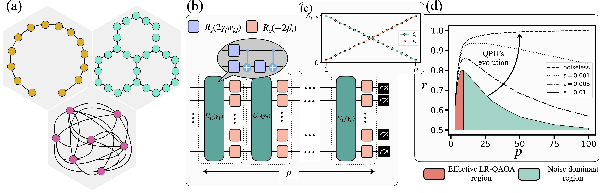
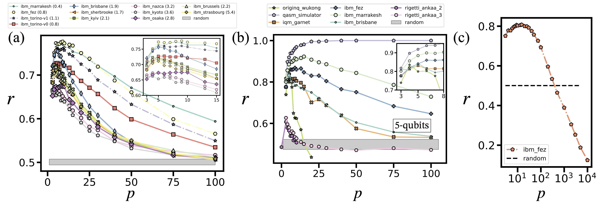
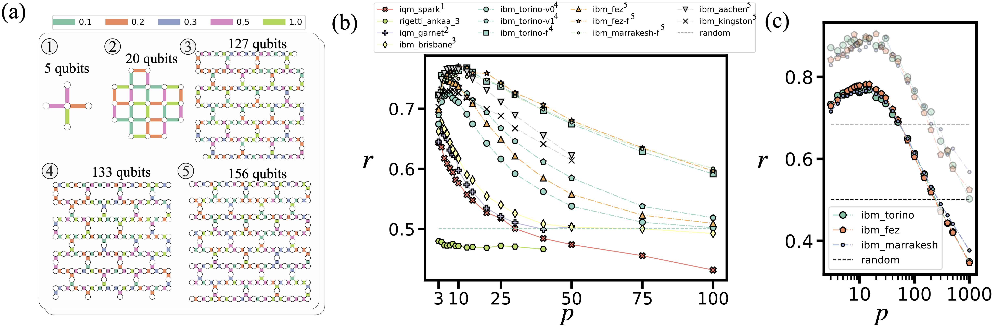
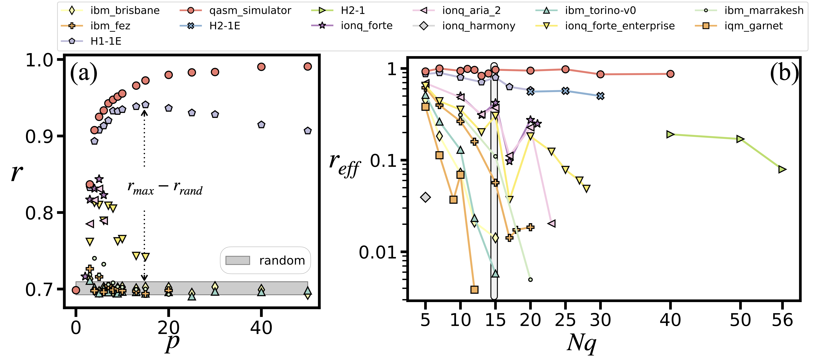

```
---  
title: LR-QAOA # Title for the tab in the web browser. The final title will be "{title} - Quantum Benchmark Zoo"  
datatable: true # Set to true if there is at least a datatable in the page  
description: LR-QAOA is a scalable benchmark that measures quantum processor performance by tracking signal decay with circuit depth.> # Description of the page. Used to set the content of the meta tag used by SEO. Should be one or two sentences with well chosen keywords.  
  Presentation of the awesome protocol blablabla...   
---
```

# LR-QAOA

## Motivation

As quantum processing units (QPUs) surpass the exact classical simulation limit, noise still hinders their practical utility. With increasing qubit counts and circuit depths, there is a pressing need for scalable, interpretable, and platform-agnostic tools that reflect meaningful progress of QPUs performance. The linear-ramp quantum approximate optimization algorithm (LR-QAOA) addresses this by offering a deterministic, non-variational QAOA protocol that gives an estimate of the usable circuit depth of a QPU. 

## Protocol

In this work, we use the **Linear Ramp Quantum Approximate Optimization Algorithm (LR-QAOA)** [[1]](https://arxiv.org/abs/2405.09169) protocol, a fixed **Quantum Approximate Optimization Algorithm (QAOA)** protocol, as an easy-to-implement, scalable benchmarking methodology. This approach assesses **Quantum Processing Units (QPUs)** at different **widths (number of qubits)** and **2-qubit gate depths**. 


Scheme of the Quantum Processing Units (QPUs) benchmarking. (a) Graphs topologies used for the benchmarking, i.e., the qubit connectivity needed to run the algorithm. In yellow is the 1D-Chain, in green is the native layout (NL), and in pink is the fully connected (FC) graph. (b) QAOA protocol consists of alternating layers of the problem Hamiltonian and the mixer Hamiltonian. $p$ represents the depth of the algorithm.
The parameters used in these unitaries follow a linear ramp schedule, as shown in (c), which approximates adiabatic evolution via first-order Trotterization. $\Delta_{\gamma, \beta}/p$ is the slope. (d) illustrates the typical behavior of the approximation ratio $r$ as a function of depth $p$ under different depolarizing noise levels $\varepsilon$.
The red region corresponds to algorithm-dominated performance, and the green region to noise-dominated behavior.
As devices improve, we expect the crossover between these regions to occur at larger $p$.

We benchmark quantum devices by solving instances of the weighted maxcut problem using LR-QAOA. The key performance metric is the approximation ratio $r$, which increases with depth and saturates at 1 in the absence of noise, degrading as coherence is lost. LR-QAOA quantifies a QPU’s ability to preserve a coherent signal as circuit depth increases, identifying when performance becomes statistically indistinguishable from random sampling.  


## Assumptions 

- We choose well-conditioned ramp schedules with observable signal growth in noise-free settings and balanced saturation under noise, validated in prior simulations
- If possible, try to describe the consequences if the assumptions are not respected

## Limitations

- Describe the limitations of the protocol

## Extensions (Facultative)

- Describe the extensions to the protocol (if extensions exist)

## Implementation

- [LR-QAOA-QPU-Benchmarking](https://github.com/alejomonbar/LR-QAOA-QPU-Benchmarking)

## Results

### 1D-Chain

The 1D-chain benchmark evaluates how well a QPU preserves the algorithmic signal as LR-QAOA depth increases along a linear qubit chain. This topology isolates the impact of circuit depth from layout constraints. We use the 99.73\% confidence threshold from a random sampler to define benchmark pass/fail behavior.

<div class="center">
   
</div>
Approximation ratio versus number of LR-QAOA layers for 1D-chain WMC problems on IBM, IQM, Rigetti, and OriginQ devices.
(a) Performance on a 100-qubit problem across IBM Eagle and Heron QPUs. Numbers in parentheses indicate EPLG at the time of execution.(b) Cross-platform comparison for a 5-qubit problem run on different QPUs.
(c) Scaling study on \texttt{ibm\_fez} from \(p=3\) to \(p=10{,}000\), reaching 990,000 ZZ gates at the deepest layer using fractional gates. The dashed line in (c) marks the expected approximation ratio of a random sampler.

### Native Layout

The NL benchmark stresses system-wide performance by employing all qubits and native couplers in each device’s layout.  
A QPU is considered to pass at a given depth $p$ if the observed approximation ratio $r$ exceeds the 99.73\% confidence threshold of the random-sampler baseline. Among all tested platforms, only \texttt{rigetti\_ankaa\_3} fails to pass the benchmark at any depth. The best-performing devices are \texttt{ibm\_fez}, \texttt{ibm\_marrakesh}, and \texttt{ibm\_torino}, all of which support fractional gates. Interestingly, \texttt{ibm\_aachen} achieves a comparable performance peak despite lacking fractional gate support, implying that it could potentially outperform the other devices once fractional gates become available on this QPU. 

<div class="center">
   
</div>


NL-based benchmarking using LR-QAOA for WMC problems on \texttt{iqm\_spark}, \texttt{iqm\_garnet}, \texttt{rigetti\_ankaa\_3}, \texttt{ibm\_brisbane}, \texttt{ibm\_torino}, and \texttt{ibm\_fez}/\texttt{ibm\_marrakesh}/\texttt{ibm\_aachen}/\texttt{ibm\_kingston}. 
Problem sizes (with number of edges in parentheses) are: 5 (4), 20 (30), 82 (138), 127 (144), 133 (150), and 156 (176).
(a) QPU layouts used in each experiment. 
Nodes represent qubits, and edges represent native two-qubit connectivity. 
Edge colors denote the WMC instance weights, randomly chosen from \{0.1, 0.2, 0.3, 0.5, 1\}, as shown at the top.
(b) Approximation ratio versus number of LR-QAOA layers $p$ for each processor.
The dashed horizontal line indicates the random-sampler baseline.
Labels with an 'f' suffix, e.g., \texttt{ibm\_marrakesh}-f, denote experiments using fractional gates.
(c) Scaling experiment with up to \(p = 1{,}000\) LR-QAOA layers using fractional gates.
Semitransparent points mark the sample with the maximum approximation ratio observed.

### Fully Connected
The FC benchmark imposes the highest stress by combining maximal depth and full-qubit connectivity, making it the toughest test of QPU coherence and routing capabilities.  A device passes if its approximation ratio $r$ exceeds the 99.73\% confidence interval of the random sampler baseline at any $p$. Since the approximation ratio achieved by random guessing increases with problem size, we normalize the approximation ratio to quantify the gain over random guessing, and denote this normalized metric as $r_{\text{eff}}$.

<div class="center">
   
</div>
Fully connected (FC) benchmarking using LR-QAOA for WMC problems with 5 to 56 qubits. 
(a) Approximation ratio $r$ versus LR-QAOA depth $p$ for a 15-qubit instance. 
Shaded region denotes the 99.73\% confidence interval of a random sampler. 
(b) Effective approximation ratio $r_{\mathrm{eff}}$ versus problem size for multiple QPUs. 
Each point reflects the best-performing depth not within the random region.
# References

@misc{montanezbarrera2024universal,
    title={Towards a universal QAOA protocol: Evidence of a scaling advantage in solving some combinatorial optimization problems},
    author={J. A. Montanez-Barrera and Kristel Michielsen},
    year={2024},
    eprint={2405.09169},
    archivePrefix={arXiv},
    primaryClass={quant-ph}
}

@misc{montanezbarrera2025evaluating,
    title={Evaluating the performance of quantum processing units at large width and depth},
    author={J. A. Montanez-Barrera and Kristel Michielsen and David E. Bernal Neira},
    year={2025},
    eprint={2502.06471},
    archivePrefix={arXiv},
    primaryClass={quant-ph}
}

## Cite references

To cite a reference, add it under the BibTex format in bibliography/references.bib and cite it with its id. The latex reference are rebuilt each time the website is being deployed ``

## Latex expressions 
Latex expression are surrounded by `$$`:   
`$$ C_{rand}(n) = \sum_{i=1}^n i \times (1-p^i)p^{i(i-1)/2} $$`

## Datatables
To add a datatable (example here with the Q-score datatable) that is automatically generated.  
The javascript permits to format the table content as latex and to set the default number of items per page.

```
  
<script type="text/javascript"> 
    $(document).ready(function() {
      $('.q-score-table').DataTable(
        {
          "pageLength": 10,
          "drawCallback": function(settings){
           MathJax.Hub.Queue(["Typeset", MathJax.Hub]);ss
          }  
        }  
      );  
    });  
</script>
```

## Images

To add an image, simply use the img tag within a div that centers the content.  
The classes img-small (50% width), img-medium (70% width), img-large (90% width) are only used for devices with more than 769px width.  
Alt expression is really important to improve the indexation of the content.  

```
<div class="center">
   
</div>
```
