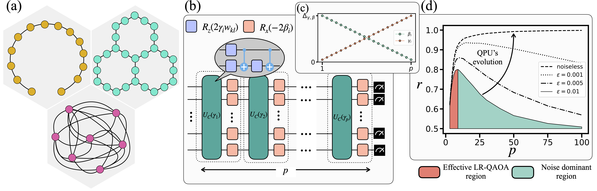

# LR-QAOA-QPU-Benchmarking
Paper:https://arxiv.org/abs/2502.06471

## Evaluating the performance of quantum process units at large width and depth

In this work, we use LR-QAOA protocol [[1]](https://arxiv.org/abs/2405.09169) as an easy-to-implement scalable benchmarking methodology that assesses quantum process units (QPUs) at different widths (number of qubits) and 2-qubit gate depths.

Scheme of the Quantum Processing Units (QPUs) benchmarking. (a) Graphs used for the benchmarking. In yellow is the 1D-Chain, in green is the native layout (NL), and in pink is the fully connected (FC) graph. (b) QAOA protocol consists of alternating layers of the problem Hamiltonian and the mixer Hamiltonian. $p$ represents the depth of the algorithm. (c) Schedule of the LR-QAOA algorithm, $\Delta_{\gamma, \beta}/p$ is the slope. (d) Expected results of LR-QAOA in terms of approximation ratio versus number of LR-QAOA layers. Black curves represent different levels of depolarizing noise strength.

